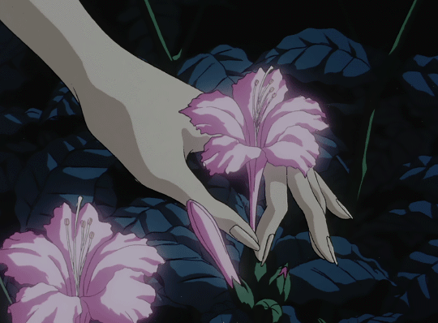

<div align="center">


# starrager

### Fullstack Developer · Vue · Node.js · TypeScript

Building web applications from **UI to API, database and deployment.**

</div>

<br>

## ⚡ Stack

<div align="center">


<br><br>


<br><br>


</div>

<br>

## 🧩 What I build

```text
Frontend       Vue 3 · Composition API · Pinia · Router
Backend        Node.js · Express · TypeScript · REST API
Database       Prisma · SQLite
Security       JWT · bcrypt · Zod
Integrations   Telegram · Email · External APIs
Deployment     Render · Surge · Docker
```

<br>

## 📫 Contact

<div align="center">

<a href="https://github.com/starrager">
  
</a>
&nbsp;&nbsp;&nbsp;
<a href="https://t.me/starragerofshit">
  
</a>
&nbsp;&nbsp;&nbsp;
<a href="mailto:vodichka2006@gmail.com">
  
</a>

</div>

<br><br>

<p align="center">
  
</p>
